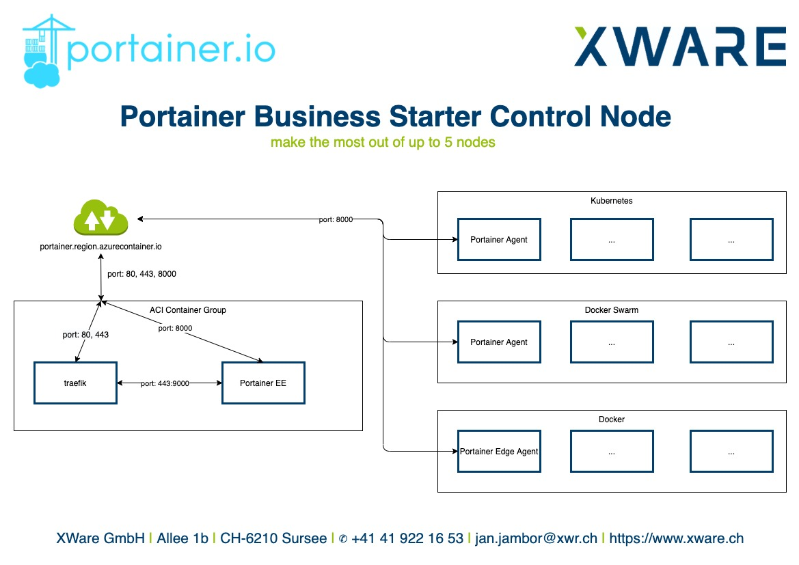
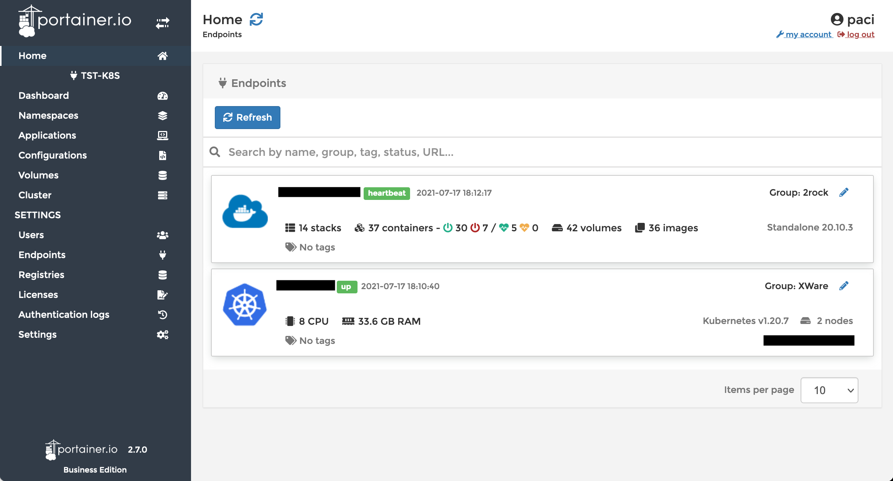

# Terraform Guide

## Update guide

Because Docker has rate limits, import the required images to dedicated container registry of your own.

```bash
az acr import \
  --name jjscontainers \
  --source docker.io/library/traefik:v2.11.28 \
  --image traefik:v2.11.28

az acr import \
  --name jjscontainers \
  --source docker.io/portainer/portainer-ee:2.32.0-linux-amd64 \
  --image portainer/portainer-ee:2.32.0-linux-amd64
```

## Why?

I'm running different Docker and Kubernetes environments as well as Azure Container Instances which are either completely disposable like development environments or environments for demos and proof of concepts. Other environments are at least highly unstable due to heavy testing. Portainer is my go-to solution to make these environments accessible and manageable. I don't want to start always on scratch with setting up Portainer, Azure AD integration, and user management when I destroy and recreate an environment. Furthermore, I want to make use of the really cool new [Portainer Business Starter](https://www.portainer.io/products/portainer-business-starter/buy-now) package.


Like a fun game: control your Portainer Business Nodes (Photo by [MART PRODUCTION from Pexels](https://www.pexels.com/photo/a-girl-playing-in-a-virtual-reality-on-yellow-background-8471966/ ))

## The idea

Having the above-mentioned scenario in mind I see myself in a situation where I don't have a stable enough environment where I can host my production Portainer Business instance. So, I'm thinking about how to do that with as small as possible administrative effort and a small technical footprint.

Here is where Azure Container Instances come in handy. There are some things to take care of e.g., port mapping is nothing they do out of the box as well as TLS certificates, but there are solutions to that I would like to explain to you in that write-up.

## The solution

Disclaimer: for the sake of not writing a big book here I skip the part of introducing all tools and technologies mentioned here. There are first-step tutorials all around the internet for each of them. And you can also contact me and I'm happy to answer questions.

Okay, the idea is pretty clear. So, let's get started. As I always do things "as code", I start setting up a new terraform project to create the required infrastructure on Azure. On a big picture view, we are going to create something like shown in the picture below.



### Stages

I'm making use of terraform workspaces to be able to test new Portainer beta releases. The script `workspacetest.sh` is either run manually like described in chapter [Manual process](#manual-process) or [the pipeline chooses it](azure-pipelines.yml) based on the selected stage. In the terraform `variables.tf` you see that variables that need to be different based on the stage are now maps that have different values for each environment.

If you want to connect to an existing Portainer Agent, that's possible as long as you are using `AGENT_SECRET` as described in chapter [Kubernetes agent](#kubernetes-agent). If you are connecting to an Edge Agent on plain old Docker boxes, you have to install a second instance of the agent like described in chapter [Docker edge agents](#docker-edge-agents).

### Storage

First of all, a storage account is created and two storage shares in it. One for Portainer and one for the traefik configuration files. ACI doesn’t know such a thing as sub-paths you might know from Kubernetes manifests. That’s why we need two storage shares.

```terraform
#############################################################################
# Storage Account & Storage Share
#############################################################################
resource "azurerm_storage_account" "default" {
    name                      = var.storage_name["PRD"]
    resource_group_name       = azurerm_resource_group.default.name
    location                  = azurerm_resource_group.default.location
    account_kind              = "Storage" # defaults "StorageV2"
    account_tier              = "Standard"
    account_replication_type  = "LRS"
    enable_https_traffic_only = "true"

    tags = {
      Environment = var.tag_environment
      Owner = var.tag_owner
      ApplicationName = var.tag_application_name
      CostCenter = var.tag_costcenter
      DR = var.tag_dr
    }
}

resource "azurerm_storage_share" "default-traefik" {
    name                 = join("-", [var.storage_share_name["PRD"], "traefik"])
    storage_account_name = azurerm_storage_account.default.name
    quota                = 50
}

resource "azurerm_storage_share" "default-portainer" {
    name                 = join("-", [var.storage_share_name["PRD"], "portainer"])
    storage_account_name = azurerm_storage_account.default.name
    quota                = 50
}
```

### Configuration files for traefik

The next thing we are doing is writing the traefik configuration files and upload them to the newly created storage share for traefik. Please note that the full content is only in the code example file not in this text. The `traefik.toml` file is pretty much standard, we are only injecting the email address from our tag variables. The `portainer.toml` file needs the future FQDN included. As terraform knows about the `azurerm_container_group.default.fqdn` only when this resource block is completed and doesn’t allow references to itself, we need to dirty hack that in here. I’m using the variable `tag_application_name` which will be also used later as DNS label for the container group. As I create all resources in the Azure region Europe West, the last part of the FQDN is `.westeurope.azurecontainer.io` which I add as hardcoded text here.

```terraform
resource "local_file" "portainer-toml" {
    content     = <<-EOT
                  {content}
                  rule = "Host(`${join("", [var.tag_application_name, ".westeurope.azurecontainer.io"])}`)"
                  {more content}
                  EOT
    
    filename = "portainer.toml"

    provisioner "local-exec" {
      command = "az storage directory create --account-name ${azurerm_storage_account.default.name} --account-key ${azurerm_storage_account.default.primary_access_key} --share-name ${azurerm_storage_share.default-traefik.name} --name \"services\" --output none"
    }

    provisioner "local-exec" {
      command = "az storage file upload --account-name ${azurerm_storage_account.default.name} --account-key ${azurerm_storage_account.default.primary_access_key} --share-name ${azurerm_storage_share.default-traefik.name} --source \"portainer.toml\" --path \"services\\portainer.toml\""
    }
}
```

### Create the containers

Creating the Portainer and traefik containers is pretty straightforward. The most important point here is the exposure of the right ports. As mentioned before there is no port mapping. So you can expose one specific port only once. We are exposing the ports `80` and `443` from the traefik container and port `8000` from the Portainer container. We make these ports also available to the outside world with the `exposed_port` option. Note that you cannot tell the container group from which container it should expose a port to the outside world. As each port can only be exposed once from all containers to the container group has only one option.

## Create your ACI

A word of warning here before you start: Ensure that you have set the Let's Encrypt `caServer` to the staging server for testing purposes. Otherwise, you'll be blocked quite quickly. Only after you tested and ensured everything is as expected, switch to the productive server.

### Automated process with pipelines

All required credentials are stored in a variable library called `aci-portainer` and are used by the pipeline. There is no need to set anything up locally.

### Manual process

Makes use of a local `azure.conf` file. Never commit this config to the repo.

```bash
# azure.conf, must be in .gitignore
tenant_id="$TENANT_ID"
subscription_id="$SUB_ID"
resource_group_name="$RESOURCE_GROUP"
storage_account_name="$STORAGE_ACCOUNT"
container_name="tfstate-aci"
key="terraform.tfstate"
```

To test things manually, run these commands:

```bash
# Prepare
terraform init -backend-config=azure.conf
terraform workspace select -or-create=true 'tst'

# Ensure formatting and documentation
terraform fmt -recursive
terraform-docs markdown table --sort-by required --output-file README.md --output-mode inject .

# Plan and apply
terraform plan -var="agent_secret=YOUR_SECRET_HERE" -out out.plan
terraform apply out.plan

# Destroy
terraform plan -destroy -out out.plan
terraform apply out.plan
```

After you have applied the terraform plan, which takes about 1 to 2 minutes, you can see the new Azure Container Instance in the portal. After another minute you can also access your Portainer instance with the `azurerm_container_group.default.fqdn` which was shown in the terraform output.

## Add instances to your control node

when you first start Portainer it asks you to add a local endpoint. But we don't have one, so skip that here. Instead, go to the endpoints menu and add your other endpoints to Portainer.

### Docker edge agents

I have some Docker instances running on remote devices like a NAS or a test Docker VM somewhere. Here I'm using the Portainer Edge Agent. First of all, add a new endpoint to your Portainer Business Control Node. You'll get the `EDGE_ID` and `EDGE_KEY` from there. If this is a disposable environment you can re-use this configuration whenever you recreate the instance. The Docker compose file for the Portainer Edge Agent looks like this:

```yaml
version: "2"

services:
  # image source https://hub.docker.com/r/portainer/agent/tags?page=1&ordering=last_updated&name=linux-amd64
  portainer_agent:
    image: portainer/agent:linux-amd64-2.6.1
    restart: always
    expose:
      - 8000
    environment:
      - EDGE=1
      - EDGE_ID={{your-edge-id}}
      - EDGE_KEY={{your-edge-key}}
      - CAP_HOST_MANAGEMENT=1
    volumes:
      - /var/run/docker.sock:/var/run/docker.sock
      - /var/lib/docker/volumes:/var/lib/docker/volumes
      - /:/host
      - portainer_agent_data:/data

volumes:
  portainer_agent_data: {}
```

### Kubernetes agent

Again you have to add an endpoint to your Portainer Business Control Node. Follow the instructions there and install the Portainer Agent in your cluster. I'm using the load balancer setup here. So we need to get the IP address and port of the created service.

```bash
➜  ~ kubectl get services -n portainer
NAME                       TYPE           CLUSTER-IP     EXTERNAL-IP     PORT(S)             AGE
portainer-agent            LoadBalancer   10.0.113.88    1.2.3.4   9001:12345/TCP      3m57s
portainer-agent-headless   ClusterIP      None           <none>          <none>              3m57s
```

Azure Network Security Groups (NSG) are partially automatically set up. Please take a look at your Azure Loadbalancer (LB) and the applied NSG. Maybe you have to adjust these either in your Kubernetes Cluster or on the Azure Container Instance where you are running your Portainer Business Control Node.

**Important Note** copied from the Portainer documentation about connecting to an agent:

> Please be aware that this could potentially open up the Agent for use by anybody in case the Docker host is reachable from the internet. Publishing the Agent port 9001 in host mode basically means opening up this port in the Docker hosts firewall for all interfaces. Therefore it is highly recommended to use the AGENT_SECRET environment variable to define a shared secret, see Shared secret. The Agent implements the Trust On First Use (TOFU) principle, so only the first Portainer to connect will be able to use it, but you want to avoid an attacker beating you to it.

The Portainer Business Control Node will make use of that `AGENT_SECRET` by setting the respective environment variable. As this should never be committed to a repository, we make use of a `terraform.tfvars` file in case we are running Terraform locally. Ensure to add this file to your `.gitignore`. If the deployment of the container instance is run as a pipeline, we use a variable called `agent_secret` from the library `aci-portainer`.

For a Portainer Agent on a Kubernetes Cluster, we are going to create a secret that contains the `AGENT_SECRET`. Please be aware that secrets in Kubernetes are not encrypted but Base64 encoded. So everybody who has access to the secret can decrypt it. You should preferably use a secret store like Azure Key Vault. But this is not part of this write-up. Ensure to create the secret within the Portainer namespace.

```bash
kubectl create namespace portainer
kubectl create secret generic portainer-agent-secret --from-literal=AGENT_SECRET=YOURSECRET -n portainer
```

After that you can apply the Portainer Agent manifest with the secret added as volume to the deployment:

```yaml
...
        env:
        - name: AGENT_SECRET
          valueFrom:
            secretKeyRef:
              name: portainer-agent-secret 
              key: AGENT_SECRET

...

      volumes:
      - name: portainer-agent-secret
        secret:
          secretName: portainer-agent-secret
```

### Azure Container Instances

You can follow these instructions to add Azure Container Instances as an endpoint: [How-to: Using Portainer to manage Azure Container Instances](https://support.portainer.io/kb/article/37-how-to-using-portainer-to-manage-azure-container-instances/)

**Important Note**: there is a known bug (or incompatibility) of Portainer with Azure Container Instances that have more than one container in it. See this [issue 5335 on Github](https://github.com/portainer/portainer/issues/5335).

The short version of the instruction:

- register a new app in your Azure AD
- note tenant id and directory id
- create a client secret and note that too, important: it's not possible anymore to have never expiring keys, so you need to manage that renewal somehow
- go to your subscription, access control, and add the just created app as a contributor
- add an endpoint in Portainer with the information you have noted

## Azure AD OAuth authentication

You can follow these instructions to add Azure AD OAuth authentication: [Microsoft OAuth Provider](https://documentation.portainer.io/v2.0-be/auth/oauth-ms/)

The short version of the instruction:

- register a new app in your Azure AD
- when creating the app, decide if you want to enable only accounts from one organization or multi-tenant
- add the FQDN of your Portainer instance as redirect URI
- note tenant id and directory id
- create a client secret and note that too
- add authentication method OAuth > Microsoft OAuth provider in Portainer with the information you have noted

## Summary

Summarized, the limitations of ACI and how we resolved them:

- Storage shares: we created one storage account with two shares in it, one for each container
- Port mapping: ACI cannot do port mapping as Docker can do it. We used traefik to route port 443 to the Portainer containers port 9000
- TLS certificate: ACI has an FQDN like `myportainer.region.azurecontainer.io` but doesn’t create TLS certificates for that. We are using also traefik to deal with that.

The benefit we have now is:

- We have one stable Portainer Business Starter instance which we can use as a control node for disposable or unstable instances
- We can use Portainer Agent or Portainer Edge Agent to connect to this control node
- We can make use of all the cool Portainer Business Features in these temporary environments without having to set up all from scratch all the time



## What will be next

I'll write about that later and update this repo with it.

- Deploy stacks with git integration and become fully GitOps

<!-- BEGIN_TF_DOCS -->
## Requirements

| Name | Version |
|------|---------|
| <a name="requirement_azurerm"></a> [azurerm](#requirement\_azurerm) | =2.98.0 |

## Providers

| Name | Version |
|------|---------|
| <a name="provider_azurerm"></a> [azurerm](#provider\_azurerm) | 2.98.0 |
| <a name="provider_local"></a> [local](#provider\_local) | 2.5.3 |

## Modules

No modules.

## Resources

| Name | Type |
|------|------|
| [azurerm_container_group.default](https://registry.terraform.io/providers/hashicorp/azurerm/2.98.0/docs/resources/container_group) | resource |
| [azurerm_resource_group.default](https://registry.terraform.io/providers/hashicorp/azurerm/2.98.0/docs/resources/resource_group) | resource |
| [azurerm_storage_account.default](https://registry.terraform.io/providers/hashicorp/azurerm/2.98.0/docs/resources/storage_account) | resource |
| [azurerm_storage_share.default-portainer](https://registry.terraform.io/providers/hashicorp/azurerm/2.98.0/docs/resources/storage_share) | resource |
| [azurerm_storage_share.default-traefik](https://registry.terraform.io/providers/hashicorp/azurerm/2.98.0/docs/resources/storage_share) | resource |
| [local_file.portainer-toml](https://registry.terraform.io/providers/hashicorp/local/latest/docs/resources/file) | resource |
| [local_file.traefik-toml](https://registry.terraform.io/providers/hashicorp/local/latest/docs/resources/file) | resource |

## Inputs

| Name | Description | Type | Default | Required |
|------|-------------|------|---------|:--------:|
| <a name="input_agent_secret"></a> [agent\_secret](#input\_agent\_secret) | n/a | `any` | n/a | yes |
| <a name="input_location"></a> [location](#input\_location) | n/a | <pre>map(object({<br/>    regionName = string<br/>    regionCode = string<br/>    regionUrl  = string<br/>  }))</pre> | <pre>{<br/>  "CH": {<br/>    "regionCode": "switzerlandnorth",<br/>    "regionName": "Switzerland North",<br/>    "regionUrl": "switzerlandnorth.azurecontainer.io"<br/>  },<br/>  "EU": {<br/>    "regionCode": "westeurope",<br/>    "regionName": "West Europe",<br/>    "regionUrl": "westeurope.azurecontainer.io"<br/>  }<br/>}</pre> | no |
| <a name="input_portainer_image"></a> [portainer\_image](#input\_portainer\_image) | Source: https://hub.docker.com/r/portainer/portainer-ee/tags?page=1  Download backup from Portainer settings before updateing!!!! | `map(string)` | <pre>{<br/>  "PRD": "jjscontainers.azurecr.io/portainer/portainer-ee:2.32.0-linux-amd64",<br/>  "TST": "jjscontainers.azurecr.io/portainer/portainer-ee:2.32.0-linux-amd64"<br/>}</pre> | no |
| <a name="input_resource_group_name"></a> [resource\_group\_name](#input\_resource\_group\_name) | n/a | `string` | `"rg-aci-kstjj-001"` | no |
| <a name="input_storage_name"></a> [storage\_name](#input\_storage\_name) | n/a | `map(string)` | <pre>{<br/>  "PRD": "stacikstjj001prd",<br/>  "TST": "stacikstjj001tst"<br/>}</pre> | no |
| <a name="input_storage_share_name"></a> [storage\_share\_name](#input\_storage\_share\_name) | n/a | `map(string)` | <pre>{<br/>  "PRD": "shstacikstjj001prd",<br/>  "TST": "shstacikstjj001tst"<br/>}</pre> | no |
| <a name="input_tag_application_name"></a> [tag\_application\_name](#input\_tag\_application\_name) | n/a | `map(string)` | <pre>{<br/>  "PRD": "aci-portainer",<br/>  "TST": "aci-test-portainer"<br/>}</pre> | no |
| <a name="input_tag_costcenter"></a> [tag\_costcenter](#input\_tag\_costcenter) | n/a | `string` | `"jj"` | no |
| <a name="input_tag_dr"></a> [tag\_dr](#input\_tag\_dr) | n/a | `string` | `"essential"` | no |
| <a name="input_tag_owner"></a> [tag\_owner](#input\_tag\_owner) | ############################################################################ TAGS  tag\_environment = terraform.workspace  ############################################################################ | `string` | `"jan.jambor@xwr.ch"` | no |
| <a name="input_traefik_image"></a> [traefik\_image](#input\_traefik\_image) | Source: https://hub.docker.com/_/traefik/tags?page=1&name=2. | `map(string)` | <pre>{<br/>  "PRD": "jjscontainers.azurecr.io/traefik:v2.11.28",<br/>  "TST": "jjscontainers.azurecr.io/traefik:v2.11.28"<br/>}</pre> | no |

## Outputs

| Name | Description |
|------|-------------|
| <a name="output_app-fqdn"></a> [app-fqdn](#output\_app-fqdn) | The fqdn of the app instance. |
<!-- END_TF_DOCS -->